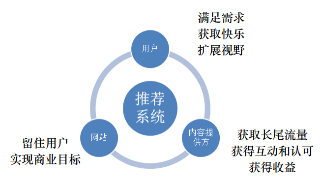
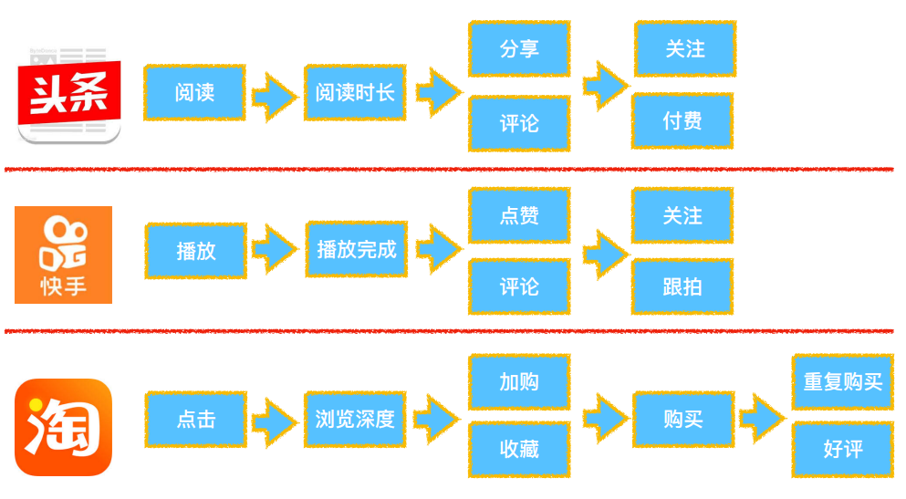

## 二 推荐系统评估

- 好的推荐系统可以实现用户, 服务提供方, 内容提供方的共赢

- 显示反馈和隐式反馈

  <table>
    <tr>
      <th></th>
      <th>显式反馈</th>
      <th>隐式反馈</th>
    </tr>
    <tr>
   <td> 例子 </td>
   <td> 电影/书籍评分 
   是否喜欢这个推荐 </td>
   <td> 播放/点击 评论 下载 购买 </td>
    </tr>
    <tr>
      <td> 准确性 </td>
      <td> 高 </td>
      <td> 低 </td>
    </tr>
    <tr>
      <td> 数量 </td>
      <td> 少 </td>
      <td> 多 </td>
    </tr>
    <tr>
      <td> 获取成本 </td>
      <td> 高 </td>
      <td> 低 </td>
    </tr>
  </table>

- 常用评估指标

  • 准确性  • 信任度
  • 满意度  • 实时性
  • 覆盖率  • 鲁棒性
  • 多样性  • 可扩展性
  • 新颖性  • 商业⽬标
  • 惊喜度  • ⽤户留存

  - 准确性 (理论角度) Netflix 美国录像带租赁
    - 评分预测
      - RMSE   MAE
    - topN推荐
      - 召回率 精准率
  - 准确性 (业务角度)

  

  - 覆盖度
    - 信息熵 对于推荐越大越好
    - 覆盖率
  - 多样性&新颖性&惊喜性
    - 多样性：推荐列表中两两物品的不相似性。（相似性如何度量？
    - 新颖性：未曾关注的类别、作者；推荐结果的平均流⾏度
    - 惊喜性：历史不相似（惊）但很满意（喜）
    - 往往需要牺牲准确性
    - 使⽤历史⾏为预测⽤户对某个物品的喜爱程度
    - 系统过度强调实时性
  - Exploitation & Exploration 探索与利用问题
    - Exploitation(开发 利用)：选择现在可能最佳的⽅案
    - Exploration(探测 搜索)：选择现在不确定的⼀些⽅案，但未来可能会有⾼收益的⽅案
    - 在做两类决策的过程中，不断更新对所有决策的不确定性的认知，优化
      长期的⽬标
  - EE问题实践
    - 兴趣扩展: 相似话题, 搭配推荐
    - 人群算法: userCF 用户聚类
    - 平衡个性化推荐和热门推荐比例
    - 随机丢弃用户行为历史
    - 随机扰动模型参数
  - EE可能带来的问题
    - 探索伤害用户体验, 可能导致用户流失
    - 探索带来的长期收益(留存率)评估周期长, KPI压力大
    - 如何平衡实时兴趣和长期兴趣
    - 如何平衡短期产品体验和长期系统生态
    - 如何平衡大众口味和小众需求
  - 评估方法
    - 问卷调查: 成本高
    - 离线评估:
      - 只能在用户看到过的候选集上做评估, 且跟线上真实效果存在偏差
      - 只能评估少数指标
      - 速度快, 不损害用户体验
    - 在线评估: 灰度发布 & A/B测试 50% 全量上线
    - 实践: 离线评估和在线评估结合, 定期做问卷调查